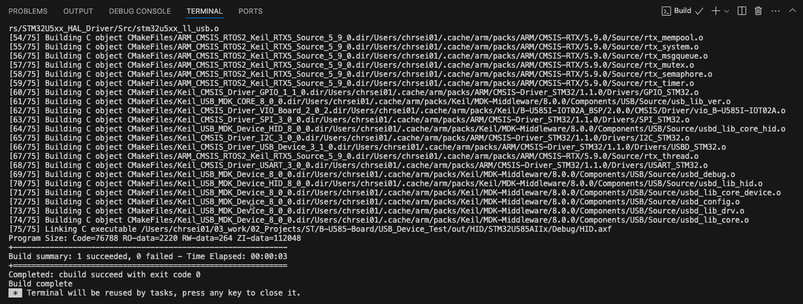

# Build a project

Before you can download the application onto your target device, you need to build it. There are various ways to trigger a
build.

## From the Explorer view

In the **Explorer** view , right-click the `*.csolution.yml` file and select
**Build solution**.

These options are also available in the right-click menu:

- **Rebuild solution**: cleans the output directories before building the cproject.
- **Clean all out and tmp directories**: cleans the output and tmp directories for the active solution.

## From the CMSIS view

In the header, click .

The **Clean all out and tmp directories** and **Rebuild solution options** are also available with
.

You can configure a build task in a `tasks.json` file to customize the behavior of the build button. All the examples on
keil.arm.com include a `tasks.json` file. See [Configure a build task](./configuration.md#configure-a-build-task) for more details.

## Build output

Once you initiated the build process, a Terminal window opens that shos the build operation:

Check the output to find where the ELF file (`.axf`) was generated.

!!! Note
    If the build fails with an ENOENT error, follow the instructions in the pop-up message that displays in the bottom
    right-hand corner for installing CMSIS-Toolbox.
