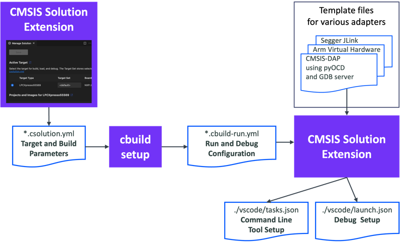
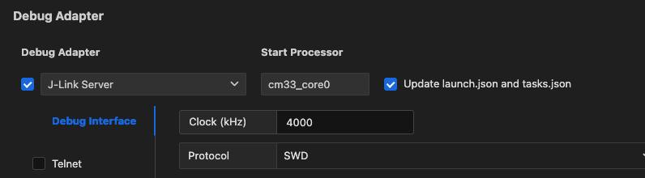

# Configuration

## Configure the extension

Press **Ctrl+,** (Windows and Linux) or **Cmd+,** (macOS) or go to  at
the bottom of the **Activity Bar** and select **Settings**. Then, select **CMSIS Solution** to change the extension
settings. The available settings are:

| Setting | Description |
|---------|-------------|
| Actions | Set run and debug configurations for your solutions and projects. |
| Download Packs | CMSIS-Toolbox downloads required software packs using `cpackget` during setup and project build. This option enables the option `--packs` for `cbuild`. |
| Exclude | Configure a glob pattern for excluding files and folders in searches for csolution files. |
| Experimental Features | Use the checkbox to enable experimental features. |
| Generate Clang Setup | Use the checkbox to automatically generate the required setup (`.clangd` file and `.vscode/settings.json`) for the active solution context. For Arm Compiler 6, include pre-defined macros in the `.clangd` file. |
| Output Directory | Enter an output directory prefix for 'outdir' and 'tmpdir' and relocated build information files (experimental). |
| Use Web Services | Use the checkbox to enable web services to obtain information about devices, boards, and examples. If enabled, information from the internet and locally installed packs is used. If disabled, only information from installed packs is used. |

## Configure a solution

The **Configure Solution** view opens automatically, if:

- Your solution has a `select-compiler:` node, but no `compiler:` node is set in the `csolution.yml` file, or
- You are working with a reference application that requires the configuration of a software layer.


- Click **Next** to display the different options available.

- You can indicate where the layers should be copied to in the **Board-Layer**, **Shield-Layer**, and **Socket-Layer**
  fields. Click **Default** to reset the paths to their default values. If there are no compatible layers, errors display.

- If no compiler is set for the reference application, **Select Compiler** displays under the layers selection and shows the
  compilers available in your environment. Select a compiler. For example, AC6 or GCC.

- If you are working with another solution type, only **Select Compiler** displays. Select a compiler.

- Click **OK**.

For reference applications only, a `Board.clayer.yml` file, a `Shield.clayer.yml` file, or a `Socket.clayer.yml` file, along
with other files that make up the layer, are added in the folders that you selected. The files are available from the
**Explorer** view. The `.clayer.yml` files come from the CMSIS-Pack. Layers are automatically added in the `csolution.yml`
file of your solution under `target-types: variables:` for the active target.

For all solution types, the compiler is added with the `compiler:` key in the `csolution.yml` file.

!!! Note
    - Not all Board Support Packs (BSPs) have board layers.
    - Not all layers are compatible with the connections that your reference application requires.
    - The CMSIS-Packs which contain reference applications and layers generally provide an `Overview.md` file where the
      connections are detailed.

## Configure run and debug

In VS Code, you can integrate external tools via a `tasks.json` file. The debug configuration is managed via the
`launch.json` file. Both files are generated automatically based on your `*.csolution.yml` file:



When creating a **Target Set** in the [**Manage Solution**](./manage_settings.md) view and selecting a
**Debug Adapter**, the information is stored in the `target-set:` node in the `*.csolution.yml` file (refer to the
[CMSIS-Toolbox user's guide](https://open-cmsis-pack.github.io/cmsis-toolbox/YML-Input-Format/#target-set) for
details on `target-set`).

When you save the target set, the **CMSIS Solution** extension calls `cbuild setup` that generates the
`*.cbuild-run.yml` file which contains the run and debug description of your solution. Using template files for the
various debug adapters from the [Debug Adapter Registry](https://github.com/Open-CMSIS-Pack/debug-adapter-registry) and
taking the user inputs into account, the **CMSIS Solution** extension then generates the `launch.json` and `tasks.json`
files.

### Debug adapter support

Keil Studio support various debug adapters and and GDB server implementations from different vendors:

- Most of the debug adapters (including ST-Link) are served by [pyOCD](#pyocd) using the
  [Arm CMSIS Debugger extension](https://marketplace.visualstudio.com/items?itemName=Arm.vscode-cmsis-debugger).
- Segger [J-Link Server](#jlink-server) is supported.
- [Arm Debugger](#arm-debugger) is supported.
- Running on [Arm FVPs](#arm-fvps) is possible.
- Arm [Keil µVision](#keil-uvision) is supported (only on Windows).

### Use debug adapters

If you are using a third-party debug adapter, make sure that the latest drivers are installed on your machine and that
the debug adapters are running the latest firmware. Set the `PATH` variable correctly.

| Debug Adapter | Notes |
|---------------|-------|
| Arm ULINKplus | Make sure that the [V2.x.x firmware](https://developer.arm.com/documentation/101636/0100/Introduction/Firmware-Update) is installed. |
| Infineon KitProg3 | Make sure that the latest [firmware is installed](https://community.infineon.com/t5/Knowledge-Base-Articles/ModusToolbox-Updating-the-KitProg3-MiniProg4-firmware-from-modus-shell/ta-p/625419#.). |
| Microchip PICKit Basic | Use the Python utility [pycmsisdapswitcher](https://pypi.org/project/pycmsisdapswitcher/) to switch the firmware to a CMSIS-DAP v2 implementation. |
| Nuvoton NuLink | Make sure that the latest [firmware is installed](https://github.com/OpenNuvoton/Nuvoton_Tools/blob/master/Latest_NuLink_Firmware/README.md). |
| NXP MCU-Link | Make sure that the latest [firmware is installed](https://community.nxp.com/t5/MCUXpresso-General-Knowledge/MCU-Link-installation/ta-p/1180326). |
| Raspberrry Pi Debugprobe | Make sure that the latest [firmware is installed](https://github.com/raspberrypi/debugprobe/releases). |
| SEGGER J-Link | For J-Link support, visit [J-Link/J-Trace Downloads](https://www.segger.com/downloads/jlink/). Set the `PATH` variable to the `bin` directory of the installation. |
| STMicroelectronics ST-Link | For ST-LINK/V2 and ST-LINK/V2-1 support on Windows, download the USB driver here: [STSW-LINK009](https://www.st.com/en/development-tools/stsw-link009.html). |

In the **CMSIS view**, open the [Manage Solution dialog](./manage_settings.md) and go to the
[Debug Adapter section](./manage_settings.md#debug-adapter). Select one of the debug adapters. Once selected, the
following JSON files are created automatically:

- In the `launch.json` file, `attach` and `launch` configurations are added that let you attach the debug adapter
  to an already running GDB instance (for example when you have issued a [`load and run`](./create_app.md#load-and-run)
  before) or launch a new debug session.
- In the `tasks.json` file, the tasks `CMSIS Erase`, `CMSIS Load`, and `CMSIS Run` are created.

!!! Note
    If you wish to preserve manual modification to the JSON files, uncheck "Update launch.json and tasks.json" in the
    **Debug Adapter for ...** section.

<!--
#### User modifications to `launch.json`

By default, the **CMSIS Solution** extension updates the `launch.json` file to reflect changed settings. Sometimes, the
user needs control over settings. The `cmsis:` - `updateConfiguration:` value in the `launch.json` file controls the
update. Change `"updateConfiguration"` to `"manual"` to control the settings and this section.

```json
            "cmsis": {
                "pname": cm33_core0
                "target-type": MCXN947 
                "updateConfiguration": "manual"     // without auto, this section is not modified
```
-->
#### Selecting a specific debug adapter

!!! ToDo
    Explain how to select a probe in case multiple are connected.

### pyOCD

In the [Manage Solution](./manage_settings.md) dialog, select the one of the debug adapters named **xyz@pyOCD**:

- Set the maximum clock speed.
- Select the debug protocol (`SWD` or `JTAG`).


### JLink Server

In the [Manage Solution](./manage_settings.md) dialog:

- Select the **JLink Server** debug adapter.
- Set the maximum clock speed.
- Select the debug protocol (`SWD` or `JTAG`).



### Arm Debugger

You can use the [Arm Debugger](https://developer.arm.com/Tools%20and%20Software/Arm%20Debugger) with Keil Studio.

#### Prerequisites

Before you can launch a debug session using Arm Debugger, you need to:

1. Install the [Arm Debugger VS Code extension](https://marketplace.visualstudio.com/items?itemName=Arm.arm-debugger).
2. Add the Arm Debugger to your `vcpkg-configuration.json` file, for example:  
   `  "arm:debuggers/arm/armdbg": "6.6.0"`

#### Setup for Arm Debugger

In the [Manage Solution](./manage_settings.md) dialog, select the one of the debug adapters named **xyz@Arm-Debugger**.


### Arm FVPs

In the [Manage Solution](./manage_settings.md) dialog:

- Select the **Arm-FVP** debug adapter
- Select the model you wish to use
- Point to your configuration file
- If you wish to set a simulation limit, add this in the **Misc** box:


### Keil uVision

In the [Manage Solution](./manage_settings.md) dialog:

- Select the **Keil uVision** debug adapter.
- Set the path to the `UV4.exe` file (the default is `%LOCALAPPDATA%\Keil_v5\UV4\UV4.exe`).


!!! Attention
    This only works on a Windows PC.

#### Changing the default

In the Debug Adapter configuration window, you can change the path to your µVision installation directory. If you do
that, the following will be saved in the `.vscode.settings.json` file:

```json
{
    "cmsis-csolution.debug-adapters": {
        "Keil uVision": {
            "uv4": "/path/to/UV4.exe"
        }
    }
}
```

This is a CMSIS solution-specific setting. If you wish to set the µVision path for all your CMSIS solution projects,
open the global `settings.json` file:

1. Click on  at the bottom left of VS Code.
2. Select **Settings**.
3. Click on  at the top right. This opens the global
   `%APPDATA%\Code\User\settings.json` file.
4. Enter the path as shown above and save the file.

<!--
### Template Files

Template files for various debug adapters are included in the installation. For reference the template files are provided in the [Debug Adapter Registry](https://github.com/Open-CMSIS-Pack/debug-adapter-registry).

A [template file in `*.json` format](https://github.com/Open-CMSIS-Pack/debug-adapter-registry/tree/main/templates) contains the following sections:

```json
    "launch":                           // section for launch.json
        "singlecore-launch":            // debugger launch request for single-core system
        "singlecore-attach":            // debugger attach request for single-core system
        "multicore-start-launch":       // debugger launch request for the start processor in multi-core system. 
        "multicore-start-attach":       // debugger attach request for the start processor in multi-core system. 
        "multicore-other":              // debugger attach request for other processors in multi-core system.

    "tasks":                            // section for tasks.json
        "label": "CMSIS Load+Run",      // command "CMSIS Load+Run"  
        "label": "CMSIS Run",           // command "CMSIS Run"
        "label": "CMSIS Load",          // command "CMSIS Load"
        "label": "CMSIS Erase",         // command "CMSIS Erase"
```

The template files are processed with the [Eta](https://eta.js.org/) template engine. It inserts data of the `*.cbuild-run.yml` file into the various sections of the template file using placeholders listed in the table below. Each section is processed depending on the system type.

Placeholder       | Description
:-----------------|:----------------
`solution_folder` | Relative path from the workspace folder to the directory that stores the `*.csolution.yml` file
`device_name`  | From `*.cbuild-run.yml`: value of [`device:`](https://open-cmsis-pack.github.io/cmsis-toolbox/YML-CBuild-Format/#file-structure-of-cbuild-runyml)
`target_type`  | From `*.cbuild-run.yml`: value of [`target-type:`](https://open-cmsis-pack.github.io/cmsis-toolbox/YML-CBuild-Format/#file-structure-of-cbuild-runyml)
`start_pname`  | From `*.cbuild-run.yml`: value of [`start_pname:`](https://open-cmsis-pack.github.io/cmsis-toolbox/YML-CBuild-Format/#debugger)
`image_files`  | From `*.cbuild-run.yml`: value list of [`output:`](https://open-cmsis-pack.github.io/cmsis-toolbox/YML-CBuild-Format/#output) with `image` information
`symbol_files` | From `*.cbuild-run.yml`: value list of [`output:`](https://open-cmsis-pack.github.io/cmsis-toolbox/YML-CBuild-Format/#output) with `symbols` information
`pname`        | Processor name in a multi-core system that is currently processed by the template engine
`ports`        | From `*.cbuild-run.yml`: value list of [`gdbserver:`](https://open-cmsis-pack.github.io/cmsis-toolbox/YML-CBuild-Format/#gdbserver)

The usage of these placeholders is exemplified with the [template files in the Debug Adapter Registry](https://github.com/Open-CMSIS-Pack/debug-adapter-registry/tree/main/templates).
-->

### Enhancing the debug experience

To ensure the best debug experience with Arm Compiler for Embedded, make sure that your CMSIS solution files contain
the following.

#### csolution.yml

In the `*.csolution.yml` file, insert the following block in `- target-types\- type` section:
  
```yml
      target-set:
        - set: 
          debugger:
            name: # set to name of your debug adapter
```

Insert the following before the `- projects` section:

```yml
  misc:
   - for-compiler: AC6
     C-CPP:
       - -gdwarf-5
     ASM:
       - -gdwarf-5
```

#### cproject.yml

In the `*.cproject.yml` file, add at the end:

```yml
  output:
    type:
     - elf
     - hex
     - map
```
