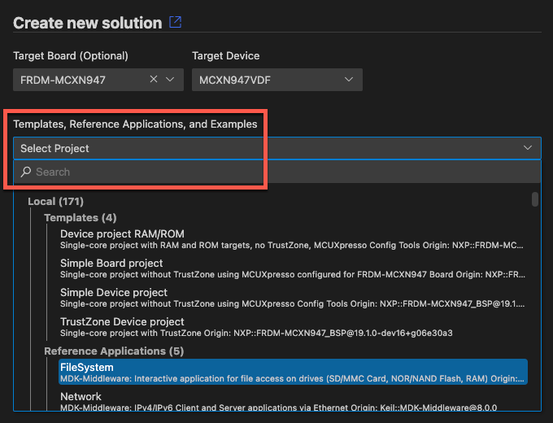
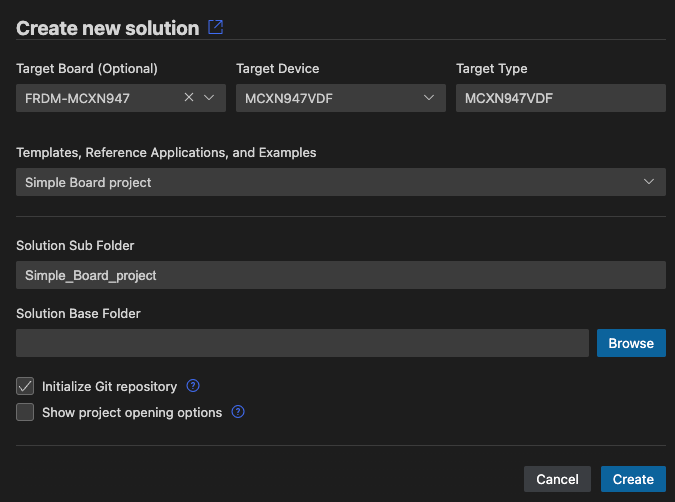

# Create an embedded project

This chapter explains how to create a CMSIS solution-based application.

## Create a new solution

In the  **CMSIS** view, click **Create a New Solution** to open the
**Create Solution** view.

!!! Note
    If you already have a solution opened in your workspace and want to create a new one in the same workspace, move
    your cursor over the three dots **...** in the **CMSIS** view, then click **Create a Solution**.

Click the **Target Board (Optional)** drop-down list. Enter a search term (here: "mcx"), and then select a board.
The details of the board that you selected display.

Click **Select**. By default, the **Target Device** drop-down list shows the name of the device mounted on the board that you selected.

!!! Note
    Alternatively, you can directly select a device in the **Target Device** drop-down list, without selecting a board first.

## Select a template, a reference application, or an example

Select one of the following options from the drop-down list. The options available depend on the board or device selected previously. If there are too many examples, enter a search term and then select an example.

### Templates

Templates help you to get started without application-specific code.

- **Blank solution**: Start a project from scratch with an empty `main.c` file and the CMSIS device startup component
  selected

- **TrustZone solution**: If the board or device that you selected is compatible, you can use TrustZone and define
  whether projects in the solution use secure or non-secure zones

### Reference applications

**Reference applications** show the usage of middleware, software libraries, and custom code that can run on many different
target hardware boards. Examples display only if you selected a board and a software layer is available for that board.
Reference applications are not dependent on specific hardware. You can deploy them to various evaluation boards using
additional software layers that provide driver APIs for specific target hardware. Layers are provided using CMSIS-Packs.

Reference applications are available with the [MDK-Middleware](https://www.keil.arm.com/packs/mdk-middleware-keil/versions/). These examples show you how to use software components for IPv4 and IPv6 networking, USB Host and Device communication, and file system for data storage. See [MDK Middleware Reference Applications](https://github.com/Open-CMSIS-Pack/cmsis-toolbox/blob/main/docs/ReferenceApplications.md#mdk-middleware-reference-applications) and the [MDK-Middleware](https://github.com/arm-software/MDK-Middleware) repository and [documentation](https://arm-software.github.io/MDK-Middleware/latest/General/index.html) for more details.

Other reference applications that illustrate how to match sensor shields and boards are also available with the Sensor SDK pack. The examples use board and shield layers. See [Sensor Reference Applications](https://github.com/Open-CMSIS-Pack/cmsis-toolbox/blob/main/docs/ReferenceApplications.md#sensor-reference-applications) and the [Sensor-SDK-Example](https://github.com/open-cmsis-pack/Sensor-SDK-Example) repository for more details.

Reference applications that use socket layers are also available. See the [AWS MQTT demo](https://github.com/Arm-Examples/AWS_MQTT_Demo) as an example.

### Csolution examples

CMSIS solution examples are targeted at a specific board or Fixed Virtual Platform (FVP) model. The examples are fully configured and ready for use.

### µVision examples

Use a µVision example in `*.uvprojx` format as a starting point. µVision examples are converted automatically.

## Configure the solution

Depending on the example/template application you have chose, you might be presented with a view that allows you to
select a compiler toolchain and/or one or more software layers.

Refer to [configure a solution](./configuration.md#configure-a-solution) for more information.

## Specify solution folders

Before creating the project, the solution's folder name and location need to be set up.

### Solution Sub Folder

After you have selected your solution template, specify a **Solution Sub Folder** where the solution files are stored.

### Solution base folder

- Click **Browse** next to the **Solution Base Folder** field and choose where to store the solution subfolder using the system
  dialog box.

- With the **Initialize Git repository** checkbox, you can initialize the solution as a Git repository. Clear the checkbox
  if you do not want to turn your solution into a Git repository.

- Select the **Show project opening options** checkbox to decide how to open the solution (in the same window, a new
  window, added to the current workspace).

- Click **Create**.

The extension creates the solution and automatically converts examples that are available only in `*.uvprojx` format. Check the **Output** tab. If there are any conversion errors and warnings, they display in the **CMSIS Solution** category. You can also check the `uv2csolution.log` file.

The following files are created for the solution:

- A `<solution_name>.csolution.yml` file.
- One or more `<project_name>.cproject.yml` files, each available in a separate folder.
    - For reference applications only, each `cproject.yml` file contains a `$Board-Layer$` variable.
    - For reference applications with sensor shields, each `cproject.yml` file contains a `$Shield-Layer$` variable.
    - For reference applications with a socket layer, each `cproject.yml` file contains a `$Socket-Layer$` variable. These
      variables are not yet defined.
- A `cdefault.yml` file containing default toolchain setting for the selected toolchain.
- A `<solution_name>.cbuild-idx.yml` file which contains overall information for the application.
- A `<solution_name>.cbuild-pack.yml` file listing all the packs that are used by the application. Missing CMSIS-Packs
  are installed automatically.
- A `<solution_name>.cbuild-set.yml` file which specifies the context set of projects, target-types, and build-types
  that are used to generate the application image
- A `<solution_name>+<target_name>.cbuild-run.yml` file which contains a build description of a single `cproject.yml`
  input file for each context.
- A main `<filename>.c` template file for each project.
- A `vcpkg-configuration.json` file to download required tools automatically.

!!! CAUTION
    If you see this warning:
    
    Click **Show output** to configure the solution. You can add board, shield, or socket layers to your reference
    application. You can also select a compiler for reference applications and other solution types.

Depending on the selected example, you might need to [configure the solution](./configuration.md#configure-a-solution)
before you can [build](./build.md) the project.
