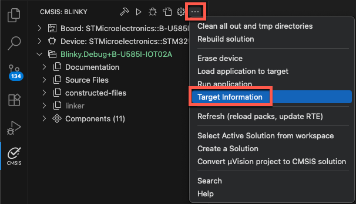
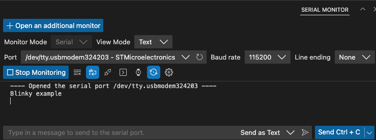

# Create new solution

This section explains how to create a *CMSIS solution-based project* that is using CMSIS-Packs.

In the  **CMSIS** view, click **Create a New Solution**. If you already have a
solution opened, use the menu (**...**) item **Create a Solution**.


The **Create new solution** dialog allows to start projects based on a **Target Board** or **Target Device** selection.

Examples, templates, and reference applications depend on the selected board or device and on installed CMSIS-Packs.

- [**Examples**](#work-with-examples) are created for a specific hardware or evaluation board. These are typically
  complete projects that directly interface with board and device peripherals.

- [**Reference Applications**](#work-with-reference-applications) use defined interfaces (APIs) and are therefore
  hardware agnostic. These projects require the installation of related CMSIS-Packs and additional software layers for
  an evaluation board.

- [**Templates**](#work-with-templates) are stub projects that help you getting started. Some CMSIS-Packs may contain
  device-specific templates.

Further settings include:

- The **Solution Sub Folder** is typically a sub-directory in your workspace.

- The **Solution Base Folder** specifies your workspace location that may contain multiple projects.

- With **Initialize Git repository** the related `.gitignore` file is created.

- **Show project opening options** allows you to open the solution a new instance of VS Code. By default, it is loaded
  into the current VS Code instance.

## Work with examples

1. Click the **Target Board (Optional)** drop-down list.
2. Enter a search term tp filter the list and then select your board. The details of the selected board are displayed.
3. Click **Select**.

Next, select the example project. There are two types of example projects (available either from **Local** packs and/or
from the **Web**):

- **Csolution Examples** are using Keil Studio's native project format.

- **uVision Examples** are in `*.uvprojx` format and are converted automatically.

To verify the Keil Studio installation, select a **Blinky** project for example.

Specify a **Solution Base Folder** and click **Create**.

!!! Note
    First time users may need to confirm that the **Arm Tools Environment Manager** extension can automatically
    activate the workspace and download the tools specified in the `vcpkg-configuration.json` file included in a
    project.

A typical Blinky example includes a `REAMDE.md` file that contains valuable information about the hardware setup and
specific tasks that need to be done before working with the target board:


Continue to [build the project](#build).

## Work with reference applications

**Reference applications** show the usage of middleware, software libraries, and custom code that can run on many
different target hardware boards. Examples display only if you selected a board and a software layer is available for
that board. Reference applications are not dependent on specific hardware. You can deploy them to various evaluation
boards using additional software layers that provide driver APIs for specific target hardware. Layers are provided
using CMSIS-Packs.

Reference applications are available with these CMSIS-Packs:

- [MDK-Middleware](https://www.keil.arm.com/packs/mdk-middleware-keil/overview/): use software components for IPv4 and
  IPv6 networking, USB Host and Device communication, and file system for data storage.

- [SDS Framework](https://www.keil.arm.com/packs/sds-arm/overview/): record real-world data off a device and playing it
  back on Arm Virtual Hardware.

- [LiteRT](https://www.keil.arm.com/packs/tensorflow-lite-micro-tensorflow/overview/): demonstrates the fundamental
  integration and usage of the LiteRT stack for ML inference on a microcontroller.

!!! Attention
    You need to have the CMSIS-Packs installed before you can create a new reference application. Please follow the
    instruction for [installing packs](./installation.md#pack-installation).

### Configuration

Reference applications use
[software layers](https://open-cmsis-pack.github.io/cmsis-toolbox/build-overview/#software-layers) that help scaling
example projects to many different target boards. To be able to use the selected board with the reference application,
you need to [configure the solution](./configuration.md#configure-a-solution) and select an appropriate layer.

More information about the layer requirements and other configuration options can be found in the documentation:

- [MDK-Middleware](https://arm-software.github.io/MDK-Middleware/latest/General/index.html)
- [SDS Framework Documentation](https://arm-software.github.io/SDS-Framework/main/index.html)

Continue to [build the project](#build).

## Work with templates

Templates help you to get started without application-specific code.

- **Blank solution**: Start a project from scratch with an empty `main.c` file and the CMSIS device startup component
  selected

- **TrustZone solution**: If the board or device that you selected is compatible, you can use TrustZone and define
  whether projects in the solution use secure or non-secure zones

Continue to [build the project](#build).

<!--
## Project contents

Once you have selected an example/template/reference application, the solution is created automatically. If a uVision
example is converted, check the **Output** tab. Conversion errors and warnings are displayed in the **CMSIS Solution**
category. You can also check the `uv2csolution.log` file.

The following files are created for the solution:

- A `<solution_name>.csolution.yml` file.

- One or more `<project_name>.cproject.yml` files, each available in a separate folder.

- A `cdefault.yml` file containing default toolchain setting for the selected toolchain.

- A `<solution_name>.cbuild-idx.yml` file which contains overall information for the application.

- A `<solution_name>.cbuild-pack.yml` file listing all the packs that are used by the application. Missing CMSIS-Packs
  are installed automatically.

- A `<solution_name>.cbuild-set.yml` file which specifies the context set of projects, target-types, and build-types
  that are used to generate the application image

- A `<solution_name>+<target_name>.cbuild-run.yml` file which contains a build description of a single `cproject.yml`
  input file for each context.

- A main `<filename>.c` template file for each project.

- A `vcpkg-configuration.json` file to download required tools automatically.

!!! CAUTION
    If you see this warning:
    
    Click **Show output** to configure the solution. You can add board, shield, or socket layers to your reference
    application. You can also select a compiler for reference applications and other solution types.

Depending on the selected example, you might need to [configure the solution](./configuration.md#configure-a-solution)
first.
-->

## Build

Before you can download the application on your target device, you need to build it. There are various ways to trigger
a build:

- In the **Explorer** view , right-click the `*.csolution.yml` file and
  select **Build solution**.

- In the **CMSIS** view , click .

You can configure a build task in a `tasks.json` file to customize the behavior of the build button. All the examples
on [keil.arm.com](https://www.keil.arm.com) include a `tasks.json` file. See
[Configure a build task](./configuration.md#configure-a-build-task) for more details.

Continue to [load and run](#load-and-run) the solution.

### Build output

After you initiate the build process, a Terminal opens and displays the build operation:

```txt
Execute: cbuild /Users/user/03_work/02_Projects/ST/Nucleo-F756ZG/Blinky/Blinky.csolution.yml --active NUCLEO-F756ZG --packs
+---------------------------------------------------
(1/1) Building context: "Blinky.Debug+NUCLEO-F756ZG"
Using AC6 V6.24.0 compiler, from: '/Users/user/.vcpkg/artifacts/2139c4c6/compilers.arm.armclang/6.24.0/bin/'
Building CMake target 'Blinky.Debug+NUCLEO-F756ZG'
[1/51] Building C object CMakeFiles/Group_Source_Files_retarget_stdio_c.dir/Users/user/03_work/02_Projects/ST/Nucleo-F756ZG/Blinky/retarget_stdio.o
[2/51] Building ASM object CMakeFiles/Group_CubeMX.dir/Users/user/03_work/02_Projects/ST/Nucleo-F756ZG/Blinky/STM32CubeMX/NUCLEO-F756ZG/STM32CubeMX/MDK-ARM/startup_stm32f756xx.o
Warning: A1950W: The legacy armasm assembler is deprecated. Consider using the armclang integrated assembler instead.
0 Errors, 1 Warning
[3/51] Building C object CMakeFiles/Group_CubeMX.dir/Users/user/03_work/02_Projects/ST/Nucleo-F756ZG/Blinky/STM32CubeMX/NUCLEO-F756ZG/STM32CubeMX/Src/stm32f7xx_hal_timebase_tim.o
...
[49/51] Building C object CMakeFiles/Keil_CMSIS_Driver_USART_3_0_0.dir/Users/user/.cache/arm/packs/ARM/CMSIS-Driver_STM32/1.1.0/Drivers/USART_STM32.o
[50/51] Building C object CMakeFiles/ARM_CMSIS_RTOS2_Keil_RTX5_Source_5_9_0.dir/Users/user/.cache/arm/packs/ARM/CMSIS-RTX/5.9.0/Source/rtx_thread.o
[51/51] Linking C executable /Users/user/03_work/02_Projects/ST/Nucleo-F756ZG/Blinky/out/Blinky/NUCLEO-F756ZG/Debug/Blinky.axf
Program Size: Code=31972 RO-data=1076 RW-data=512 ZI-data=38760  
+------------------------------------------------------------
Build summary: 1 succeeded, 0 failed - Time Elapsed: 00:00:04
+============================================================
Completed: cbuild succeed with exit code 0
Build complete
```

The output directory usually contains an ELF (`.axf`) and a HEX (`.hex`) file.

!!! Note
    If the build fails with an `ENOENT` error, follow the instructions in the pop-up message that displays in the
    bottom right-hand corner to install CMSIS-Toolbox.

To learn about the solution structure, refer to
[CMSIS-Toolbox documentation](https://open-cmsis-pack.github.io/cmsis-toolbox/build-overview/)

## Load and Run

### Check target information

In the **CMSIS** view, click  and then select "Target Information" to
check that your target is connected.



In the **Terminal**, the result of the `pyocd list` command is shown:

```sh
 *  Executing task: pyocd list --cbuild-run /Users/user/Blinky/Blinky+B-U585I-IOT02A.cbuild-run.yml 

  #   Probe/Board      Unique ID                  Target           
-------------------------------------------------------------------
  0   STLINK-V3        001000254D46501220383832   ✖︎ stm32u585aiix  
      B-U585I-IOT02A
```

!!! Note
    If your debug adapter is not shown, make sure that all
    [drivers are installed](./tipsandtricks.md#installing-debug-adapters) and that the target is connected to the PC.

### Download and run the application

In the **CMSIS** view, click . This executes the "Load & Run application" command
that flashes the project onto the target and issues a reset to start the application.

To verify that the step has run correctly, check the **Terminal** output:

```sh
 *  Executing task: pyocd load --probe stlink: --cbuild-run /Users/user/B-U585-Board/Blinky/Blinky+B-U585I-IOT02A.cbuild-run.yml 

0000712 I Loading /Users/user/B-U585-Board/Blinky/out/Blinky/B-U585I-IOT02A/Debug/Blinky.axf [load_cmd]
[==================================================] 100%
0003015 I Erased 49152 bytes (6 sectors), programmed 49152 bytes (48 pages), skipped 0 bytes (0 pages) at 20.96 kB/s [loader]
 *  Terminal will be reused by tasks, press any key to close it. 

 *  Executing task: pyocd gdbserver --probe stlink: --connect attach --persist --reset-run --cbuild-run /Users/user/B-U585-Board/Blinky/Blinky+B-U585I-IOT02A.cbuild-run.yml 

0000251 I Target type is stm32u585aiix [board]
0000434 I DP IDR = 0x0be12477 (v2 MINDP rev0) [dap]
0000511 I debugvar 'DbgMCU_AHB1_Fz' = 0x0 (0) [cbuild_run]
0000511 I debugvar 'DbgMCU_AHB3_Fz' = 0x0 (0) [cbuild_run]
0000511 I debugvar 'DbgMCU_APB1H_Fz' = 0x0 (0) [cbuild_run]
0000511 I debugvar 'DbgMCU_APB1L_Fz' = 0x0 (0) [cbuild_run]
0000511 I debugvar 'DbgMCU_APB2_Fz' = 0x0 (0) [cbuild_run]
0000511 I debugvar 'DbgMCU_APB3_Fz' = 0x0 (0) [cbuild_run]
0000511 I debugvar 'DbgMCU_CR' = 0x6 (6) [cbuild_run]
0000511 I debugvar 'DoOptionByteLoading' = 0x0 (0) [cbuild_run]
0000511 I debugvar 'TraceClk_Pin' = 0x40002 (262146) [cbuild_run]
0000511 I debugvar 'TraceD0_Pin' = 0x20009 (131081) [cbuild_run]
0000511 I debugvar 'TraceD1_Pin' = 0x2000a (131082) [cbuild_run]
0000511 I debugvar 'TraceD2_Pin' = 0x40005 (262149) [cbuild_run]
0000511 I debugvar 'TraceD3_Pin' = 0x2000c (131084) [cbuild_run]
0000516 I AHB5-AP#0 IDR = 0x14770015 (AHB5-AP var1 rev1) [discovery]
0000517 I AHB5-AP#0 Class 0x1 ROM table #0 @ 0xe00fe000 (designer=020:ST part=482) [rom_table]
0000518 I [0]<e00ff000:ROM class=1 designer=43b:Arm part=4c9> [rom_table]
0000518 I   AHB5-AP#0 Class 0x1 ROM table #1 @ 0xe00ff000 (designer=43b:Arm part=4c9) [rom_table]
0000520 I   [0]<e000e000:SCS M33 class=9 designer=43b:Arm part=d21 devtype=00 archid=2a04 devid=0:0:0> [rom_table]
0000520 I   [1]<e0001000:DWT M33 class=9 designer=43b:Arm part=d21 devtype=00 archid=1a02 devid=0:0:0> [rom_table]
0000521 I   [2]<e0002000:BPU M33 class=9 designer=43b:Arm part=d21 devtype=00 archid=1a03 devid=0:0:0> [rom_table]
0000522 I   [3]<e0000000:ITM M33 class=9 designer=43b:Arm part=d21 devtype=43 archid=1a01 devid=0:0:0> [rom_table]
0000523 I   [5]<e0041000:ETM M33 class=9 designer=43b:Arm part=d21 devtype=13 archid=4a13 devid=0:0:0> [rom_table]
0000524 I   [6]<e0042000:CTI M33 class=9 designer=43b:Arm part=d21 devtype=14 archid=1a14 devid=40800:0:0> [rom_table]
0000524 I [1]<e0040000:TPIU M33 class=9 designer=43b:Arm part=d21 devtype=11 archid=0000 devid=ca1:0:0> [rom_table]
0000525 I [2]<e0044000:DBGMCU class=15 designer=020:ST part=000> [rom_table]
0000533 I CPU core #0: Cortex-M33 r0p4, v8.0-M architecture [cortex_m]
0000533 I   Extensions: [DSP, FPU, FPU_V5, MPU] [cortex_m]
0000533 I   FPU present: FPv5-SP-D16-M [cortex_m]
0000534 I Setting core #0 (Cortex-M33) default reset sequence to ResetSystem [cbuild_run]
0000534 I 4 hardware watchpoints [dwt]
0000537 I 8 hardware breakpoints, 1 literal comparators [fpb]
0000662 I Semihost server started on port 4444 (core 0) [server]
0000718 I GDB server started on port 3333 (core 0) [gdbserver]
```

When running,  changes to . Use it to stop
the GDB session anytime.

!!! Notes
    - When you have several solutions in one folder, VS Code ignores the `tasks.json` and `launch.json` files that
    you created for each solution. Instead, VS Code generates new JSON files at the root of the workspace in a
    `.vscode` folder and ignores the other JSON files. As a workaround, open one solution first, then add other
    solutions to your workspace with the **File** > **Add Folder to Workspace** option.
    - If you are using a multi-core device and you did not specify a `"processorName"` in the `launch.json` file,
      select the appropriate processor for your project in the **Select a processor** drop-down list at the top of the
      window.

### Monitor printf messages

Keil Studio includes the **Serial Monitor** extension that connects to the target's serial output port. If your example
contains `printf` statements, use the Serial Monitor to observe them.

