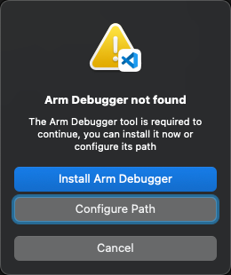

# Debug the application

Debugging is an essential task for every embedded developer. You can debug your code on real hardware or on simulation
models based on Fixed Virtual Platforms (FVPs).

## Debug on hardware

- Check that your device is connected to your computer.

- To start a debug session, click  in the **Activity Bar**.

- Select a debug configuration in the list .

- Click .

!!! Note
    If you are using a multicore device and you did not specify a `"processorName"` in the `launch.json` file, select the
    appropriate processor for your project in the **Select a processor** drop-down list at the top of the window.

The **Run and Debug** view displays and the debug session starts. The debugger stops at the `main()` function of the program:

The **Debug Console** tab displays the debugging output.

## Debug on simulation models

FVPs are complete simulations of an Arm system, including a processor, memory, and peripherals. These are set out in a "programmer's view" that gives you a comprehensive model on which to build and test your software.

!!! Note
    FVPs are natively available on Windows and Linux only. If you are on a Mac, follow this [Learning Path](https://learn.arm.com/install-guides/fvps-on-macos/) to install Docker and clone the [FVPs-on-Mac](https://github.com/Arm-Examples/FVPs-on-Mac) repository.

- Go to the Device Manager  and select the FVP that you want to
  use. For example, `MPS2 Cortex M4`.

- To start a debug session, click  and select the `Arm Debugger FVP`
  debug configuration in the list.

    

- Click .

## Troubleshooting

If the Arm Debugger engine cannot be found on your machine, a dialog box displays:

Select one of these options:  

- To add Arm Debugger to your environment, click **Install Arm Debugger**. The `vcpkg-configuration.json` file is updated.

- To indicate the path to the Arm Debugger engine in the settings, click **Configure Path**.
