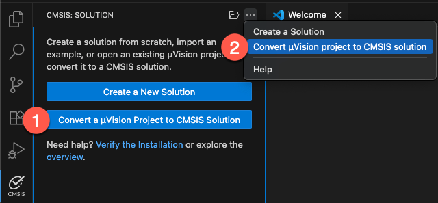
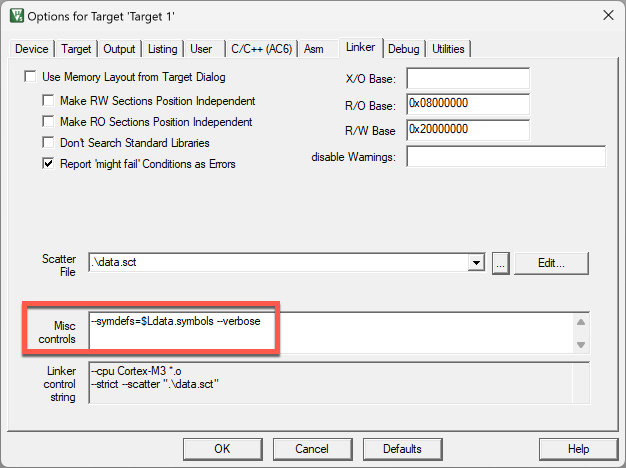

# Import a Keil µVision project

In Keil Studio, you can convert a Keil μVision project to a CMSIS solution by opening the folder that contains the
`*.uvprojx` file that you want to convert. Then, do one of the following:

- From the **Explorer view**, right-click the `*.uvprojx` file and select **Convert μVision project to CMSIS solution**.
- From the **CMSIS view**, choose one of the following options:



1. Click **Convert a μVision Project to CMSIS Solution** and open your `*.uvprojx` file to convert it.
2. Click **Views and More Actions** , then select
   **Convert μVision project to CMSIS solution** and open your `*.uvprojx` file to convert it.

   A dialog box displays. You can carry out the following tasks:

      - Open the solution in a new workspace with the **Open** option.

      - Open the solution in a new window and new workspace with the **Open project in new window** option.

   You can also run the **CMSIS: Convert μVision project to CMSIS solution** command from the Command Palette. In that case, select the `*.uvprojx` that you want to convert on your machine and click Select.

   If a `*.csolution.yml` file already exists in the same folder as the `*.uvprojx file`, then a pop-up message displays in the bottom right-hand corner. Click **Overwrite** to overwrite the existing file. The conversion starts immediately.

3. Confirm that the **Arm Tools Environment Manager extension** can automatically activate the workspace and download the tools specified in your `vcpkg-configuration.json` file.

4. Check the **Output** tab. If there are any conversion errors and warnings, they display in the **CMSIS Solution** category. You can also check the `uv2csolution.log` file.

The `*.cproject.yml` and `*.csolution.yml` files are available in the folder where the `*.uvprojx` is stored.

## Caveats

Depending on how your µVision project is written, the conversion may encounter problems. The following is a (non-exhaustive)
list of issues you might see.

### Using Arm Compiler 5

The conversion *does not work* with Arm Compiler 5-based projects. Only projects using Arm Compiler 6 can be converted.

**Solution**

Update an Arm Compiler 5 project to Arm Compiler 6 in Keil μVision, then convert the project to a CMSIS solution in VS
Code.

!!! Note
    For more information, see the
    [Migrate Arm Compiler 5 to Arm Compiler 6 application note](https://developer.arm.com/documentation/kan298/latest/) and
    the [Arm Compiler for Embedded Migration and Compatibility Guide](https://developer.arm.com/documentation/100068/0620/ating-from-Arm-Compiler-5-to-Arm-Compiler-for-Embedded-6).

### Using dollar sign in linker misc controls

In µVision, you can use the dollar sign (`$`) for Linker misc options in the Options for Target dialog:



This will cause a malformed YML access sequence in the generated `cproject.yml` file that will fail during builds.

**Solution**

Remove the `$` sign and save the project in Keil μVision, then convert the project to a CMSIS solution in VS Code.

### Using dots in project file names

In µVision project names, you can use the dot, e.g. MyProject_1.0.uvprojx. In CMSIS solution project format, dots are used
to separate project names, build type, and target types (refer to
[Context](https://open-cmsis-pack.github.io/cmsis-toolbox/build-overview/#context)). Thus, using dots in project names
will lead to:

```txt
error csolution: schema check failed, verify syntax
```

**Solution**

Remove dots from project names.

### Project located in paths containing a dollar sign

In some operating systems, paths can contain the dollar (`$`) sign. Building the project will fail with a similar
message:

```txt
error csolution: malformed access sequence: '/$test/Blinky_FRDM-K32L3A6
```

**Solution**

Use the `-O` option to redirect all output to a directory without the `$` sign.

### Component mismatches when using generators

Older projects using GPDSC-based generators will see an issue after the conversion. In the original uvprojx file, an entry
for STM32CubeMX could look like this:

```xml
      <component Cclass="Device" Cgroup="STM32Cube Framework" Csub="STM32CubeMX" Cvendor="Keil" Cversion="1.1.0" condition="STCubeMX" generated="1" generator="STM32CubeMX">
        <package name="FrameworkCubeMX" schemaVersion="1.0" url="project-path" vendor="Keil" version="1.0.0"/>
        <targetInfos>
          <targetInfo name="nucleo"/>
        </targetInfos>
      </component>
```

Modern DFPs with [generator support](https://open-cmsis-pack.github.io/cmsis-toolbox/build-overview/#generator-support)
would look like:

```xml
      <component Capiversion="1.0.0" Cclass="Device" Cgroup="STM32Cube Framework" Csub="STM32CubeMX" Cvendor="Keil" Cversion="1.0.0" condition="STM32H7_SC" generator="STM32CubeMX">
        <package name="STM32H7xx_DFP" schemaVersion="1.6.3" url="http://www.keil.com/pack/" vendor="Keil" version="2.7.0"/>
        <targetInfos>
          <targetInfo name="nucleo"/>
        </targetInfos>
      </component>
```

`uv2csolution` adds a non-existing pack node `Keil::FrameworkCubeMX@^1.0.0` which will lead to an error like this:

```txt
error csolution: required pack: Keil::FrameworkCubeMX@^1.0.0 not installed
```

**Solution**

Delete the corresponding line from the `cproject.yml` file.
