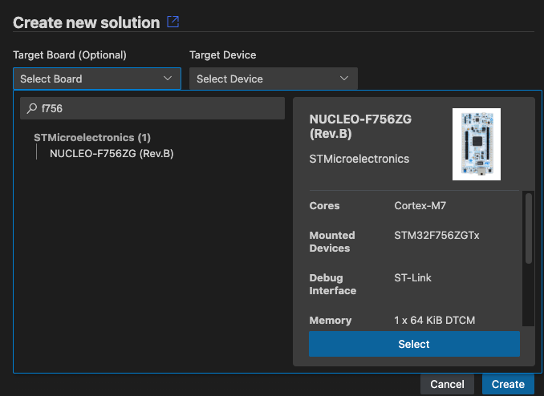
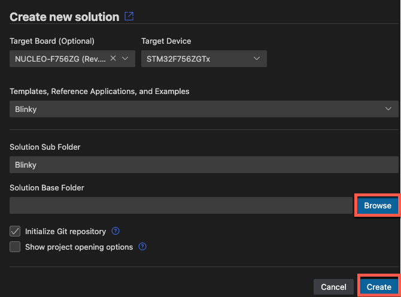

# Installation

<!-- markdownlint-disable MD036 -->

The [**Arm Keil Studio Pack (MDK v6)**](https://marketplace.visualstudio.com/items?itemName=Arm.keil-studio-pack)
extension pack includes the extensions that are required to work with CMSIS solution projects.

1. In VS Code, open the **Extensions** view and type `Keil Studio Pack` in the search bar.

2. Click **Install** to start the installation. When the installation is finished, the CMSIS view icon appears in the
   activity bar.

You can [create your first application](./create_app.md) or
[verify the installation with an example project](#verify-the-installation) and then check that you can build, run, and
debug the application.

!!!Note
    If you do not want to install all the extensions available in the pack, you can install the
    [Arm CMSIS Solution](https://marketplace.visualstudio.com/items?itemName=Arm.cmsis-csolution) extension standalone.
    Search for `CMSIS Solution` in the **Extensions** view.

## Verify the installation

The [CMSIS boards list](https://www.keil.arm.com/boards/) contains many examples that you can use to verify that Keil
Studio works correctly.

The following example explains how to start from a Blinky project for the
[STMicroelectronics NUCLEO-F756ZG](https://www.keil.arm.com/boards/stmicroelectronics-nucleo-f756zg-revb-2251244)
development board. Adapt the steps for your target hardware.

1. In the **CMSIS** view, click **Create a New Solution** to open the **Create Solution** view.
2. Click the **Target Board** drop-down list. Enter a search term, for example "f756", and then select the
   "NUCLEO-F756ZG (Rev.B)" board.  
     
3. Click **Select**. By default, the **Target Device** drop-down list shows the name of the device mounted on the board
that you selected.
4. Click the **Templates, Reference Applications, and Example** drop-down list. Enter a search term, for example
   "Blinky", and then select the "Blinky" example from the web.  
   
5. Click **Browse** to set a base forlder for the solution, then click **Create**.  
     
6. Confirm that the Arm Tools Environment Manager extension can automatically activate the workspace and download the
   tools specified in the `vcpkg-configuration.json` file included in your project.  
     

Now you can now [build](./build.md) and [debug](./debug.md) the example project.  During the build process missing
software packs may be downloaded.
