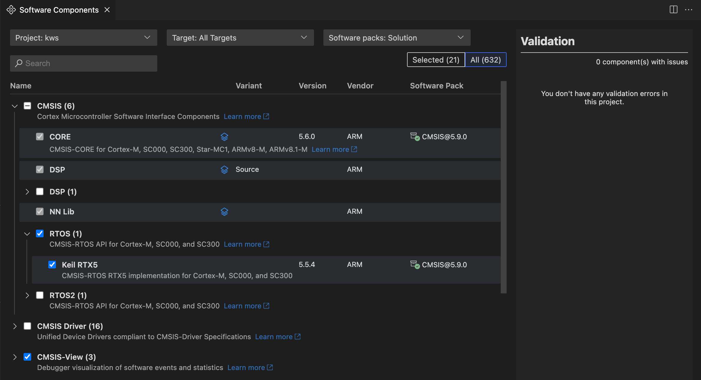

# Manage software components

The **Software Components** view shows all the software components selected in the active project of a solution.

You can do the following:

- [Modify the software components](#modify-the-software-components-in-your-project) of the project

- Manage the dependencies between components for each target type defined in your solution, or for all the target types at
  once

## Software Components view

Open the CMSIS view . In the **Solution outline**, click **Manage software components**
 at the project level. The **Software Components** view
opens:

The default view displays the components available from the packs listed in your solution. Use the **Search** field to
search the list of components.

Layer icons  indicate which components are used in layers. In the current version,
layers are read-only, so you cannot select or clear them. Click the layer icon of a component to open the `*.clayer.yml`
file or associated files.

**Learn more** links are available for some components. Click the links to open the related documentation.

## Modify the software components in your project

You can add components from all the packs available, not just the packs that are already selected for a project.

### Modify the context displayed

- In the **Project** drop-down list, select the project for which you want to modify software components.

- In the **Target** drop-down list, select a specific target type. If you want to modify all the target types at once,
  select **All Targets**. Note that you might have only one target.

- In the **Software packs** drop-down list, you can filter on the components available from the packs listed in your
  solution with the **Solution: &lt;Solution-name&gt;** option. You can display the components from all installed packs with
  the **All installed packs** option.

### Select components

Check that the **All** toggle button is selected to display all the components available. Switch to **Selected** to display
only the components that are already selected.

Use the checkboxes to select or clear components as required. For some components, you can also select a vendor, variant,
or version. The `cproject.yml` file is automatically updated.

### Validation

Manage the dependencies between components and solve validation issues from the **Validation** panel. Issues are highlighted in red and have an exclamation mark icon  next to them. You can remove conflicting components from your selection or add missing component dependencies from a suggested list.

If there are validation issues, move your cursor over the issues in the **Validation** panel to get more details. Click the
proposed fixes to find the components in the list. In some cases, you might have to choose between different fix sets. Select
a fix set in the drop-down list, make the required component choices, and then click **Apply**.

If a pack is missing in the solution, a **Component's pack is not included in your solution** message displays in the
**Validation** panel. An error also displays in the **Problems** view. Install the pack with the [`cpackget`](https://open-cmsis-pack.github.io/cmsis-toolbox/build-tools/#cpackget-invocation) command.

There can also be issues such as:

- A component that you selected is incompatible with the selected hardware and toolchain

- A component that you selected has dependencies which are incompatible with the selected hardware and toolchain

- A component that you selected has unresolvable dependencies

In such cases, you must remove the component. Click **Apply** from the **Validation** panel.
