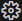

# Manage Solution

In the **Manage Solution** view, you can select the target, projects, and build types that are included in the
application image. You can also specify the debug adapter that you are using for target connectivity.

In the **CMSIS view**, click **Manage Solution Settings** . The
**Manage Solution** view opens:

## Context Set

In the **Context Set** section, you can change the [active target](#active-target) type, and the
[active projects](#active-projects) included in the build, as well as the build type of a project.

### Active Target

Select a **Target Type** to specify the hardware used to build the solution for.

To specify your target types by editing the YAML file directly, click
**Edit targets, build-types and project references in csolution.yml**.

### Active Projects

Select the **project(s)** that are part of the solution.

Select a **Build Type** for each project. You can set different build types for different projects in your solution.

Click **Edit cproject.yml** next to a project to open the `<project-name>.cproject.yml` file.

!!! Note
    The projects and build types that you can select are defined by contexts for a particular target. Some options
    might be unavailable if they have been excluded for the target selected. To learn more about contexts and how to
    modify them, see the
    [Context](https://github.com/Open-CMSIS-Pack/cmsis-toolbox/blob/main/docs/YML-Input-Format.md#context) and
    [Conditional build](https://github.com/Open-CMSIS-Pack/cmsis-toolbox/blob/main/docs/YML-Input-Format.md#conditional-build)
    information in the CMSIS-Toolbox documentation.  
    For example, you can use `for-context` and `not-for-context` to include or exclude target types at the `project:`
    level in the `*.csolution.yml` file.

### Errors and warnings

You can inspect errors and warnings for a context set. For active projects in the context set, errors and warnings
display when you move your cursor over the **Context Set** in the status bar. The indicator is red for errors and yellow
in case of warnings.

Click the indicator to open the **Output** tab for the **CMSIS Solution** category. If you previously closed the
**Manage Solution** view, then this action also re-opens the view.

You can also go to the **Problems** tab and check for errors.

Open the `main.c` file and check the IntelliSense features available. To find out about the different features, read the VS Code documentation on [IntelliSense](https://code.visualstudio.com/docs/editor/intellisense).

## Debug Adapter

Use this drop-down to select the debug adapter that you are using for target connectivity. A broad range of adapters is
supported:

- CMSIS-DAP

- Infineon KitProg3

- NXP MCU-Link

- Nuvoton Nu-Link

- Microchip PICkit

- Segger J-Link

- STMicroelectronics ST-Link
