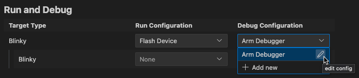

# Manage solution settings

In the **Manage solution settings** view you can set the context of your solution. The context set selects the target and
defines projects and build types that are included in the application image.

In the **Solution** outline, click **Manage Solution Settings** . The
**Manage Solutions** view opens:

You can change the [**Active Target**](#active-target) type, the [**Active Projects**](#active-projects) included in the
build. You can change the build type of a project. You can also change the run and debug configurations, or add new
configurations.

## Active Target

Select a **Target Type** to specify the hardware used to build the solution. Some examples are also compatible with Arm
Virtual Hardware (AVH) targets, in which case more options are available. For more details, read the
[AVH solutions overview](https://arm-software.github.io/AVH/main/overview/html/index.html).

Click **Edit targets, build-types and project references in csolution.yml** to specify your target types by editing the YAML
file directly.

## Active Projects

This section shows each project that is part of the solution. Use the checkbox to add a project to or to remove it from the
context set. The **Project Name** is shown, but cannot be changed.

Select a **Build Type** for each project. You can set different build types for different projects in your solution.

Click **Edit cproject.yml** next to a project to open the `<project-name>.cproject.yml` file. YAML syntax support helps you
with editing.

!!! Note
    The projects and build types you can select are defined by contexts for a particular target. Some options might be
    unavailable if they have been excluded for the target selected. To learn more about contexts and how to modify them, see
    the [Context](https://github.com/Open-CMSIS-Pack/cmsis-toolbox/blob/main/docs/YML-Input-Format.md#context) and
    [Conditional build](https://github.com/Open-CMSIS-Pack/cmsis-toolbox/blob/main/docs/YML-Input-Format.md#conditional-build)
    information in the CMSIS-Toolbox documentation. For example, you can use `for-context` and `not-for-context` to include
    or exclude target types at the `project:` level in the `*.csolution.yml` file.

## Run and Debug

Choose a run configuration and a debug configuration to use for your solution. You may select different run and debug
configurations for each project included in the solution. You can also:

Move your mouse over an entry in the list and click the pen icon to edit an existing configuration with the visual editor:

Click **+ Add new** to add a new configuration.

## Errors and warnings

You can inspect errors and warnings for a context set. For active projects in the context set, errors and warnings
display when you move your cursor over the **Context Set** in the status bar. The indicator is red for errors and yellow
in case of warnings.

Click the indicator to open the **Output** tab for the **CMSIS Solution** category. If you previously closed the
**Manage Solution** view, then this action also re-opens the view.

You can also go to the **Problems** tab and check for errors.

Open the `main.c` file and check the IntelliSense features available. To find out about the different features, read the Visual Studio Code documentation on [IntelliSense](https://code.visualstudio.com/docs/editor/intellisense).
