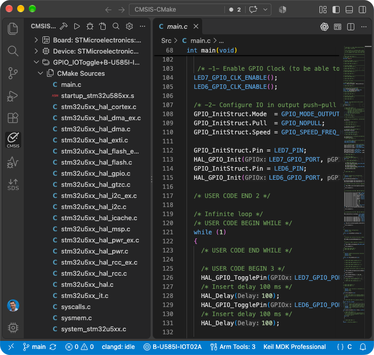

# Work with native CMake applications

It is possible to build and debug native CMake applications with Keil Studio. The **CMSIS** view displays an outline of
the native CMake project.



## Prerequisites

Make sure that your `vcpkg_configuration.json` file contains an entry for CMake and Ninja (and a compiler toolchain):

```json
{
    "registries": [
        {
            "name": "arm",
            "kind": "artifact",
            "location": "https://artifacts.tools.arm.com/vcpkg-registry"
        }
    ],
    "requires": {
        "arm:tools/kitware/cmake": "4.3.3",
        "arm:tools/ninja-build/ninja": "1.13.2",
        "arm:compilers/arm/arm-none-eabi-gcc": "15.3.1"
    }
}
```

## Settings

Copy the CMake application directory that you want to use to your CMSIS solution workspace/folder. Refer to the example
available on GitHub: [CMSIS-CMake](https://github.com/Arm-Examples/CMSIS-CMake).

### Csolution settings

Native CMake projects are listed under `projects:` in the `*.csolution.yml` file and use the solution's `target-types:`
and `build-types:`. Their declared output images are included in the generated `*.cbuild-run.yml` file and can
therefore be combined with images from other project contexts for programming and debugging.

The native project remains responsible for its `CMakeLists.txt`, toolchain setup, build targets, and generated files.
Paths under `images:` identify outputs relative to the native project's context output directory.

**Example:**

```yml
solution:
  target-types:
    - type: DualCoreDevice
      device: Vendor::DualCoreDevice

  projects:
    - cmake:
        source: ./core0
        device: :Core0
        images:
          - image: build/core0.elf
            type: elf
```
