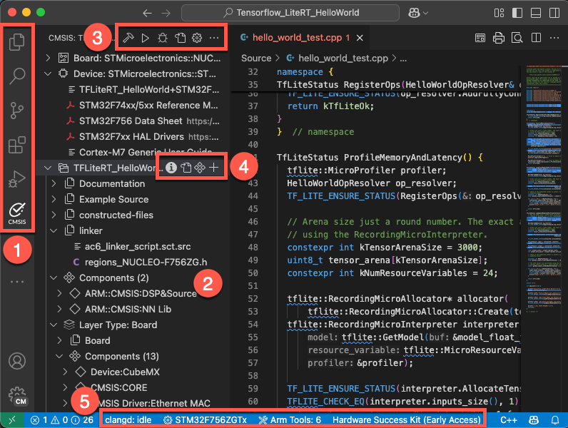
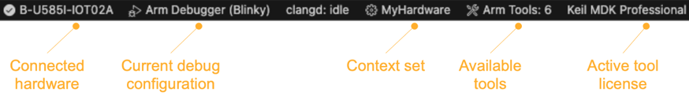
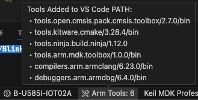

# Quick start

CMSIS Solution is an extension for Visual Studio Code that provides a GUI for the underlying
[CMSIS-Toolbox](https://open-cmsis-pack.github.io/cmsis-toolbox/) project management and build tools. Together with other
Arm and third-party extensions, the CMSIS Solution extension gives you access to a powerful embedded development environment.

This quick start guide provides an overview of the project management capabilities available from the [CMSIS view](#cmsis-view)
and shows how the [status bar](#status-bar) helps you to understand the project and environment setup.

## Available commands

You can access commands to manage your solution and the projects it includes:

- From the [**CMSIS** view](#cmsis-view).

- When you right-click the `*.csolution.yml` file from the **Explorer** view.

- When you click the [Context Set status bar item](#status-bar).

- When you press Ctrl+Shift+P (Windows and Linux) or Cmd+Shift+P (macOS) to open the Command Palette.

| Command | Description |
|---------|-------------|
| [Manage Solution Settings](./manage_settings.md) | Set a context for your solution |
| [Build solution](./build.md)                     | Build the solution with the current context set |
| Clean all out and tmp directories        | Clean all out and tmp directories for the active solution |
| [Configure Solution](./configuration.md#configure-a-solution) | Set a compiler and add layers |
| [Convert µVision project to CMSIS solution](./importuv.md) | Convert uvprojx files to the CMSIS Solution format |
| [Create a Solution](./create_app.md)     | Start from scratch |
| [Debug](./debug.md)                      | Debug the solution with the current context set |
| Focus on Solution View                   | Opens the CMSIS view |
| [Manage software components](./manage_components.md) | Review, add, or remove software components |
| Rebuild solution                         | Rebuild the solution with the current context set |
| Refresh (reload packs, update RTE)       | Reload information from all installed packs and run `cbuild setup update-rte` |
| [Run](./flash.md)                        | Run the solution on your target |
| Run Configuration Generator                            | Open a generator program with the current target |
| Select solution from workspace           | If you have several solutions in your workspace, switch between solutions and select the active solution |

## CMSIS view

The CMSIS view  shows the content of the active projects included in the solution. Each
project contains configuration settings, source code files, build settings, and other project-specific information. The
extension uses these settings and files to manage and build a software project for a board or device.

The main area shows:

- **Groups and files**: Groups and user files that you add to the project and that you can edit

- **constructed-files**: Contains generated files such as the `RTE_Components.h` header file for each context

- **linker**: Contains a linker script file and a &lt;regions&gt;.h file (or other user-defined header files)

- **Components**: Shows the software components selected for the project with their source files, user code templates, and
  APIs. Click the files to open them in the editor. Click the book icon of a component to open the related documentation.
  If you are using a generator to configure your device or board, then a **Run Configuration Generator** option is available to start a
  generator session.

- **Layer Type** (if available): The software layers in the project with their source files, preconfigured software
  components, and configuration files

## Status bar

The Visual Studio Code status bar displays information about the status of your development environment and the project. The number of extensions installed might vary.

Here is an example of how the status bar can look like:

- If you have a development board connected, the **connected hardware** displays using the **Arm Device Manager** extension.
  Click the connected hardware to open the extension.

- The **current debug configuration** displays using the **Arm Debugger** extension

- You can inspect errors and warnings for a context set. For active projects in the context set, errors and warnings display
  when you move your cursor over the **Context Set** in the status bar. The indicator is red for errors and yellow in case
  of warnings. Click the indicator to open the **Output** tab for the **CMSIS Solution** category. If you previously closed
  the **Manage Solution** view, then this action also re-opens the view.
  

- The **Arm Tools Environment Manager** extension shows information about the tools installed. Move your mouse over **Arm Tools** to review the list. Click **Arm Tools** to get more options.
  

- If you are using licensed Arm tools, the **active license** displays. Click the active license to manage it.
