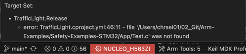
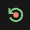

# User Interface

The **CMSIS Solution** extension provides the Keil Studio GUI for project management and build tools with the
[CMSIS-Toolbox](https://open-cmsis-pack.github.io/cmsis-toolbox/). Combined with other Arm and third-party extensions,
it implements a powerful embedded development environment.

The GUI consists of these views:

| View | Description |
|:----:|:------------|
|  | [**Explorer** view](https://code.visualstudio.com/docs/getstarted/userinterface#_explorer-view) lists all local files. |
|  | **Search** view enables [search/replace](https://code.visualstudio.com/docs/editing/codebasics#_search-across-files) across all files. |
|  | [**Source Control** view](https://code.visualstudio.com/docs/sourcecontrol/overview) allows you to work with git. |
|  | [**Extensions** view](https://code.visualstudio.com/docs/configure/extensions/extension-marketplace) lets you work with VS Code extensions. |
|  | **Run and Debug** view switches the GUI to a dedicated [debug view](./debug.md#debugger-user-interface). |
|  | [**CMSIS** view](#cmsis-view) is the main view for working with CMSIS solution-based projects. |
|  | [**Trace and Live** view](./debug.md#trace-and-live-view) shows trace and live data during debugging. |

!!! Note
    The ordering of the icons may be different in your VS Code environment.

## CMSIS view

The CMSIS view  shows the content of the active projects included in the
solution. Each project contains configuration settings, source code files, build settings, and other project-specific
information. The main area of the **CMSIS** view shows:

- **Board** and **device** information and related documentation.
- **Groups and files**: Groups and user files that you add to the project and that you can edit
- **constructed-files**: Contains generated files such as the `RTE_Components.h` header file for each context
- **linker**: Contains a linker script file and a &lt;regions&gt;.h file (or other user-defined header files)
- **Components**: Shows the software components selected for the project with their source files, user code templates, and
  APIs. Click the files to open them in the editor. Click the book icon of a component to open the related documentation.
  If you are using a generator to configure your device or board, then a **Run Configuration Generator** option is available to start a
  generator session.
- **Layer Type** (if available): The software layers in the project with their source files, preconfigured software
  components, and configuration files

### Actions available through the **CMSIS** view

| Action | Description |
|:------:|:------------|
|  | [**Build solution**](./build_run.md) calls the compiler toolchain and builds the solution. |
|  | [**Load & Run application**](./build_run.md#load-and-run) flashes the binary onto the target and starts the application. |
|  | [**Load & Debug application**](./debug.md) flashes the binary onto the target and starts a debug session. |
|  | **Open csolution.yml file** opens the CMSIS solution YML file for editing. |
|  | Open the [**Manage Solution**](./manage_settings.md) view to configure project and debug settings. |
|  | Show further [commands](#available-commands). |

### Main area icons

Depending on the file and the context, various icons may appear:

| Action | Description |
|:------:|:------------|
|  | IntelliSense is active for this cproject file. |
|  | Open the file. |
|  | Manage the software components of the cproject file. |
|  | Add groups or files to the cproject file. |

### Configuration Wizard

[Configuration Wizard annotations](https://open-cmsis-pack.github.io/Open-CMSIS-Pack-Spec/main/html/configWizard.html)
enable GUI-like elements in IDEs for configuration source files. This graphical approach makes it easier for users
to review and edit configuration settings as required by the application.

For files containing configuration wizard annotations, open the graphical view by pressing the **Open Preview** button
 in the top right corner of the file window.

The view will be opened next to the original source file. You can switch back pressing the **Show Source** button
.

## Status bar

The VS Code status bar displays information about the status of your development environment and the project.

- Status message of the clangd extension that provides smart features.

- You can inspect errors and warnings for the active csolution project when you move the cursor over the **Target Set** in the
  status bar. The indicator is red for errors and yellow for warnings. Click the indicator to open the
  **Output - CMSIS Solution** [panel](https://code.visualstudio.com/api/ux-guidelines/panel) and the [**Manage Solution**](./manage_settings.md) view. 
  

- The [**Arm Tools Environment Manager**](https://marketplace.visualstudio.com/items?itemName=Arm.environment-manager) extension downloads, installs, and manages software development tools. Move your mouse over **Arm Tools** to review the current list of installed tools. Click **Arm Tools** to get more options. 
  

- If you are using licensed Arm tools, the **active license** displays. Click the active license to manage it.

## Run and Debug view

Refer to the [Debugger user interface](./debug.md#debugger-user-interface) section for more information.

<!--
!!! Tip
    The [Arm CMSIS Debugger README](https://marketplace.visualstudio.com/items?itemName=Arm.vscode-cmsis-debugger)
    contains a more detailed description of the usage of this view.

The **Run and Debug View**  in Keil Studio connects to the target using
the request selection shown below.

1. Select the core you want to **launch** (start an application) or **attach** to (connect to a running application).
2. Interact with the cores.

### Run and Debug controls

Depending on the target device (number of cores etc.), a similar run and debug control bar will be visible:

 or

The icons enable access to:

| Icon | Action | Description |
|:----:|:-------|:------------|
|  | Continue | Resume normal program execution (up to the next breakpoint). |
|  | Pause | Inspect code executing at the current location. |
|  | Step over | Execute the next statement as a single command without inspecting or following its component steps. |
|  | Step into | Enter the next statement to follow its execution line-by-line. |
|  | Step out | When inside a function, return to the earlier execution context by completing remaining lines of the current method as though it were a single command. |
|  | Restart | Terminate the current program execution and start debugging again using the current run configuration. |
|  | Stop |  Terminate the current debug session. |
|  | Disconnect |  Detach debugger from a core without changing the execution status (running/pause). |
|  | Reset | Reset target device. |

## Trace and Live view

The **Trace and Live View**  contains the **LIVE WATCH** section that
continuously displays the value of an expression while the program is running.  Future versions of this view will also
show trace information.

You can add expressions to the **LIVE WATCH** by:

1. Pressing the `+` sign and entering an expression.
2. Using the context menu item **Add to Live Watch** in the editor or the the **Run and Debug** view.

-->
## Available commands

You can access commands to manage your solution and the related projects in the following ways:

- From the [**CMSIS** view](#cmsis-view).
- With right-click to the `*.csolution.yml` file in the [**Explorer**](https://code.visualstudio.com/docs/getstarted/userinterface#_explorer-view) view.
- With the [Command Palette](https://code.visualstudio.com/docs/getstarted/userinterface#_command-palette) that opens with Ctrl+Shift+P (Windows and Linux) or Cmd+Shift+P (macOS).

| Command | Description |
|:--------|:------------|
| Open Solution in Workspace...            | If your workspace contains several solutions, select the active solution to work with. |
| [Create Solution...](./create_app.md)    | Create a new *csolution project*.  |
| [Convert a µVision project to CMSIS solution...](./importuv.md) | Convert uvprojx files to *csolution project* format. |
| Close Solution                           | Close the current active solution. |
| [Manage Solution Settings](./manage_settings.md) | Configure the target set (active target, projects, images, and debug adapter) for the solution. |
| [Configure Solution](./create_app.md#configure-a-solution) | Set a compiler and add software layers. |
| [Manage Software Components](./create_app.md#software-components) | Review, add, or remove software components. |
| [Build solution](./build_run.md)         | Build the solution with the current target set. |
| Rebuild solution                         | Rebuild the solution with the current target set. |
| Clean all out and tmp directories        | Clean all out and tmp directories for the active solution. |
| Refresh (reload packs, update RTE)       | Reload information from all installed packs and run `cbuild setup update-rte`. |
| [Load & Run application](./build_run.md#load-and-run)       | Load the application to target and run it with active GDB server ([Debugger](./debug.md) can be attached). |
| [Load & Debug application](./debug.md)                      | Load the application to target and start the debugger. |
| Erase target device            | Erase the target device. |
| Load application to target     | Load the application to target. |
| Run application on target      | Run the current application in the target with active GDB server ([Debugger](./debug.md) can be attached). |
| Target Information             | Show information about debug adapter and target. |
| Focus on Solution View                   | Open the [CMSIS view](#cmsis-view). |
