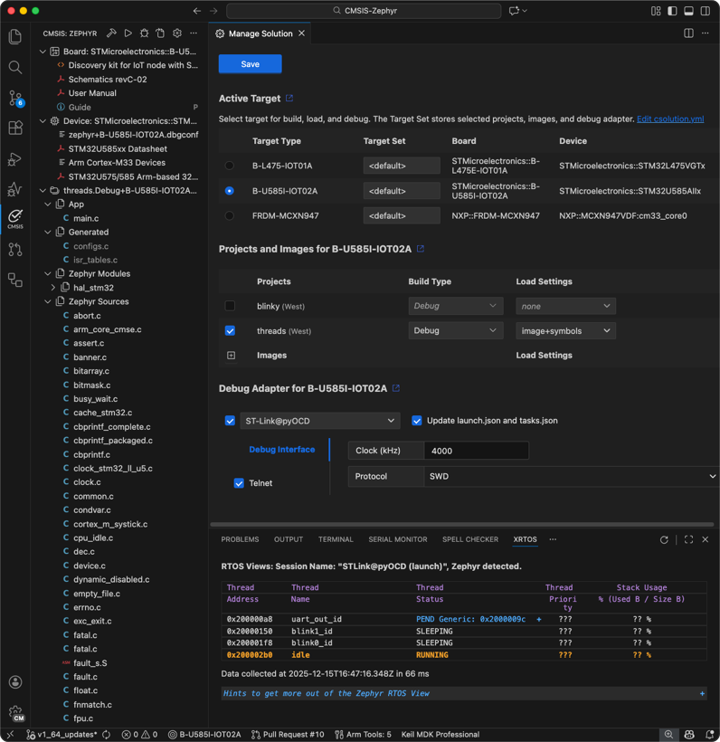

# Work with Zephyr projects

It is possible to build and debug Zephyr projects that use the `west` build system with Keil Studio. The CMSIS solution
extension displays an outline view of the Zephyr project.



## Prerequisites

To work with Zephyr-based projects, make sure that the following is set up on your machine.

### Zephyr installation

Follow the [Zephyr Getting Started Guide](https://docs.zephyrproject.org/latest/develop/getting_started/index.html) for
your host operating system and install Zephyr in a central location on your machine.

### Set environment variables

For the build process, it is required to set environment variables for the CMSIS Solution extension.

- Open the [Extension settings](https://code.visualstudio.com/docs/configure/settings#_extension-settings) and
  navigate to **CMSIS Solution**.
- Select if you want to set the *Environment Variables* for the
  [**User**](https://code.visualstudio.com/docs/configure/settings#_user-settings) or the current
  [**Workspace**](https://code.visualstudio.com/docs/configure/settings#_workspace-settings).
!!! Attention
    The workspace settings are stored in the `.vscode\settings.json` file. If you use "Initialize Git repository" when
    creating a csolution, this file is ignored by default.
- Use **Add Item** to add the following environment variables:

| Item        | Value |
|-------------|-------|
| ZEPHYR_BASE | $HOME/zephyrproject/zephyr |
| PATH        | $HOME/zephyrproject/.venv/bin |
| VIRTUAL_ENV | $HOME/zephyrproject/.venv |

- This will be translated into the following JSON code:

```json
    "cmsis-csolution.environmentVariables": {
        "ZEPHYR_BASE": "$HOME/zephyrproject/zephyr",
        "PATH": "$HOME/zephyrproject/.venv/bin",
        "VIRTUAL_ENV": "$HOME/zephyrproject/.venv"
        },
```

!!! Note
    Using the `activate` command in a Terminal window will activate this virtual environment.

## Project settings

Copy the Zephyr project directory that you want to use to your CMSIS solution workspace/folder. Refer to the example
available on GitHub: [CMSIS-Zephyr](https://github.com/Arm-Examples/CMSIS-Zephyr)

### Csolution settings

- In a `csolution.yml` file, you may have
  [west build](https://open-cmsis-pack.github.io/cmsis-toolbox/YML-Input-Format/#west-build)-specific settings.
- You must not have a `cproject.yml` file present. Instead, the `csolution.yml` file points to the Zephyr project path:

```yml
  # List related projects.
  projects:
    - west:
        app-path: ./blinky
```

### Zephyr project settings

When using the [Arm GNU Toolchain](https://developer.arm.com/Tools%20and%20Software/GNU%20Toolchain) for building the
project via `vcpkg`, make sure that the C library shipped with the toolchain used. This can be ensured with the
following settings in the Zephyr `prj.conf` file:

```conf
# Use Newlib from the Arm GNU Toolchain
CONFIG_NEWLIB_LIBC=y
# Disable Picolibc
CONFIG_PICOLIBC=n
CONFIG_PICOLIBC_USE_MODULE=n
CONFIG_MINIMAL_LIBC=n
```

For managing run and debug configurations, continue to [manage the solution](./manage_settings.md).
